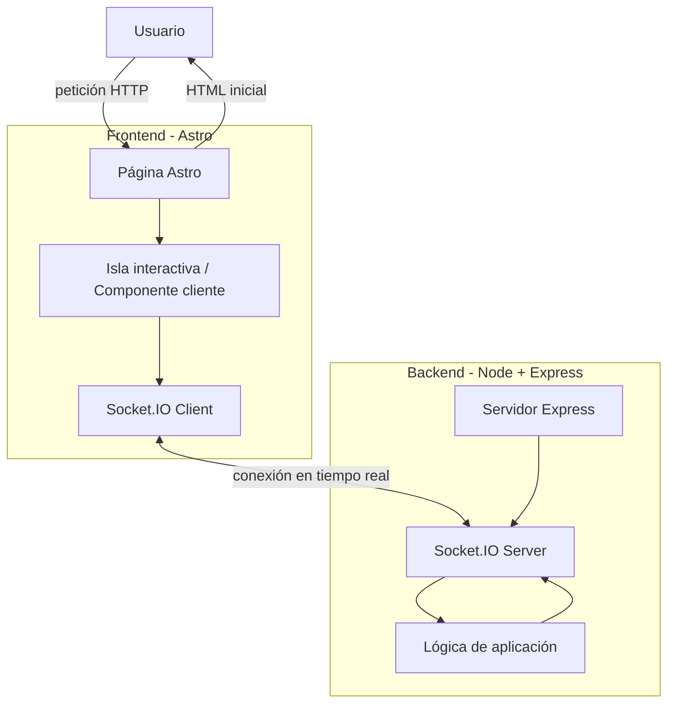

```mermaid
flowchart TD
    U[Usuario]

    subgraph FRONTEND[Frontend - Astro]
        P[Página Astro]
        IC[Isla interactiva / Componente cliente]
        CLI[Socket.IO Client]
    end

    subgraph BACKEND[Backend - Node + Express]
        HTTP[Servidor Express]
        WS[Socket.IO Server]
        LOGIC[Lógica de aplicación]
    end

    U -->|petición HTTP| P
    P -->|HTML inicial| U
    P --> IC
    IC --> CLI

    CLI <--> |conexión en tiempo real| WS
    HTTP --> WS
    WS --> LOGIC
    LOGIC --> WS
```