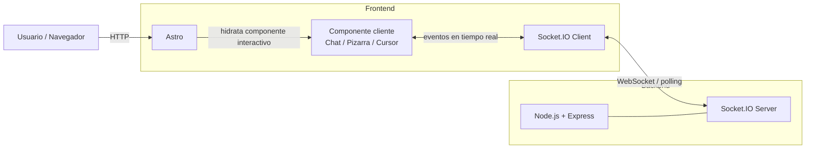

```mermaid
flowchart LR
    U[Usuario / Navegador]

    subgraph F[Frontend]
        A[Astro]
        C[Componente cliente<br/>Chat / Pizarra / Cursor]
        SIOClient[Socket.IO Client]
    end

    subgraph B[Backend]
        E[Node.js + Express]
        SIOServer[Socket.IO Server]
    end

    U -->|HTTP| A
    A -->|hidrata componente interactivo| C
    C <--> |eventos en tiempo real| SIOClient
    SIOClient <--> |WebSocket / polling| SIOServer
    E --- SIOServer
```