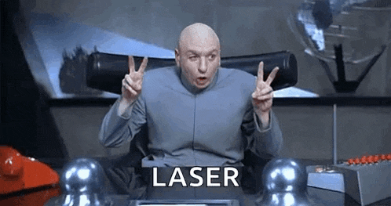
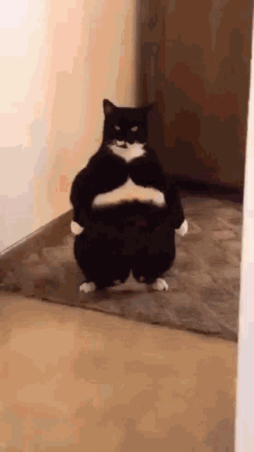
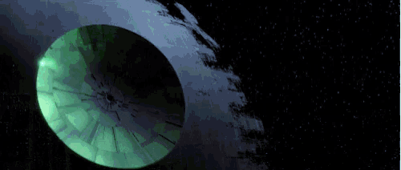

En la sesión de hoy se ha trabajado sobre el ejercicio 3 de la sesión 6, que consistía en crear una aplicación de dibujo colaborativo utilizando Astro y Socket.IO.

Se ha introducido un cliente nuevo para la aplicación: administrador.

Exiten dos tipos de usuarios: administrador y usuario normal.

el administrador sólo puede ver los trazos de los usuarios normales, pero no puede dibujar ni ver su propio cursor.

el usuario normal sigue con las mismas funcionalidades que antes: puede dibujar, ver su cursor y ver los trazos de los demás usuarios normales.

El servidor se ha modificado para gestionar esta nueva funcionalidad, diferenciando entre los tipos de usuarios y enviando la información de los trazos sólo a los usuarios normales.

---

Mas adelante el administrador se extrae de proyecto de astro para crear un proyecto independiente con Express y Socket.IO, que se conecta al mismo servidor de Socket.IO que el cliente de Astro.

---

Se presenta el proyecto final:

# El laser

Desarrollar un sistema cliente-servidor capaz de controlar en tiempo real una pieza visual pensada para ser proyectada mediante luz.

|  |  |  |
| ------------------------------ | ------------------------------ | ------------------------------ |

El proyecto deberá tener tres partes diferenciadas:

1. Cliente web en Astro

Interfaz visual e interactiva desde la que el usuario controla la pieza. 2. Servidor en Node.js con Socket.IO
Servidor intermedio encargado de recibir eventos del cliente web y comunicarlos en tiempo real. 3. Cliente externo en Node.js con Socket.IO Client
Aplicación independiente que recibe los datos del servidor y los prepara para ser enviados a un sistema físico de proyección de luz.

La arquitectura deberá estar pensada para que, en una fase posterior, este tercer cliente pueda incorporar una librería específica de control láser.

## Encargo

Cada grupo deberá investigar cómo se puede controlar un sistema de luz proyectada desde código JavaScript/Node.js.

La investigación deberá llevaros a descubrir qué herramientas existen para conectar software creativo con hardware de proyección láser, qué conceptos técnicos aparecen en ese ecosistema y qué limitaciones tiene trabajar con este tipo de medio.

A partir de esa investigación, deberéis construir un primer prototipo funcional basado en comunicación en tiempo real.

El prototipo podrá trabajar inicialmente con simulación o representación visual en pantalla, pero deberá estar diseñado para poder evolucionar hacia una salida láser real.

## Arquitectura obligatoria

El proyecto deberá implementar la siguiente arquitectura:

```
[Cliente web Astro]
|
| Socket.IO
v
[Servidor Node.js + Socket.IO]
|
| Socket.IO
v
[Cliente Node.js + Socket.IO Client]
|
v
[Salida visual / simulador / sistema láser]
```

## Requisitos mínimos

El proyecto deberá incluir:

- una aplicación web creada con Astro;
- una interfaz que permita modificar parámetros visuales en tiempo real;
- un servidor Node.js con Socket.IO;
- un cliente Node.js independiente usando Socket.IO Client;
- comunicación en tiempo real entre las tres partes;
- una representación visual o simulada de la salida;
- una investigación documentada sobre cómo podría conectarse el sistema a - hardware láser real;
- una reflexión sobre seguridad y condiciones de uso;
- documentación del proceso, errores, pruebas y decisiones tomadas.

Investigación obligatoria

Cada grupo deberá investigar y documentar:

- qué tecnologías permiten controlar sistemas de proyección de luz desde código;
- qué tipo de hardware o dispositivos intermedios se necesitan;
- qué formatos, protocolos o estándares aparecen en este ámbito;
- qué librerías de JavaScript o Node.js existen para trabajar con este tipo de salida;
  cómo se puede simular el resultado sin disponer inicialmente de hardware físico;
- qué restricciones visuales tiene este medio frente a una pantalla convencional;
- qué riesgos de seguridad existen al trabajar con luz láser o sistemas de proyección intensa.

No se proporcionará una lista cerrada de tecnologías. Parte del trabajo consiste en encontrar, comparar y justificar las herramientas adecuadas.

##Propuesta creativa

Además de la parte técnica, cada grupo deberá diseñar una pequeña pieza creativa.

La pieza podrá estar basada en:

- formas geométricas;
- líneas y trayectorias;
- movimiento generativo;
- interacción con ratón o teclado;
- control desde móvil o navegador;
- sonido;
- datos externos;
- performance visual en directo;
- reinterpretación de un sketch previo de p5.js.

Se valorará especialmente que la propuesta esté pensada para el medio de salida investigado, no simplemente como una animación de pantalla.

## Entregables

Cada grupo deberá entregar:

### 1. Código del proyecto

Repositorio con:

- cliente Astro;
- servidor Node.js;
- cliente Node.js externo;
- instrucciones de instalación y ejecución;
- explicación clara de cómo se comunican las partes.

### 2. Memoria de investigación

Documento breve que explique:

- qué han investigado;
- qué tecnologías han encontrado;
- qué conceptos técnicos han descubierto;
- qué librerías o herramientas han considerado;
- qué solución proponen para una futura conexión con hardware real;
- qué problemas o limitaciones han identificado.

### 3. Prototipo funcional

Demostración del sistema funcionando:

- interacción desde el cliente Astro;
- envío de datos al servidor;
- recepción en el cliente externo;
- visualización, simulación o preparación de la salida.

### 4. Documentación del proceso

Capturas, vídeos, diagramas, pruebas fallidas, decisiones técnicas y evolución del proyecto.

### 5. Reflexión final

Texto breve sobre:

- qué cambia al diseñar para una salida física;
- qué dificultades técnicas han aparecido;
- qué posibilidades creativas ofrece este medio;
- cómo evolucionaría el proyecto con más tiempo o equipamiento.

### 6. Declaración de uso de IA

Si se han usado herramientas de IA, deberá indicarse para qué se han usado y qué tipo de indicaciones se han dado.

## Criterios de evaluación

Se valorará:

- correcta separación entre cliente web, servidor y cliente externo;
- uso adecuado de Node.js y Socket.IO;
- calidad de la comunicación en tiempo real;
- investigación técnica realizada;
- capacidad para encontrar tecnologías relevantes por cuenta propia;
- claridad de la arquitectura;
- adecuación de la propuesta visual al medio investigado;
- documentación del proceso;
- reflexión sobre seguridad;
- originalidad y potencial creativo del prototipo.

## Restricciones

No se aceptará una entrega que consista únicamente en copiar un tutorial o ejecutar un ejemplo sin comprenderlo.

No se valorará positivamente una solución generada automáticamente sin investigación, adaptación ni explicación propia.

El proyecto debe demostrar que el grupo ha sido capaz de explorar un ecosistema técnico nuevo, entender sus piezas principales y construir una primera arquitectura preparada para evolucionar hacia una salida física real.

---

Una vez propuesta la arquitectura y los requisitos, se ha comenzado a trabajar en la parte de investigación, buscando información sobre cómo controlar un sistema de proyección de luz desde código JavaScript/Node.js.

Se presenta el Laser (hardware) que usaremos para la practica.
Se presenta el DAC (Digital to Analog Converter) que se usará para controlar el láser. (Ether Dream)
Se presenta ILDA, el formato de datos que se usará para controlar el láser.
Se presenta @laser-dac, la librería de Node.js que se usará para enviar datos al DAC.

---

Se hace un pequeño hello world para probar la librería @laser-dac y enviar un trazo simple al láser.

```javascript
import { DAC } from "@laser-dac/core";
import { EtherDream } from "@laser-dac/ether-dream";

const dac = new DAC();
dac.use(new EtherDream());
const started = await dac.start();
if (started) {
  const pps = 30000; // points per second
  // draw a horizontal red line from left to right in the center
  // @laser-dac/draw can help you with drawing points!
  const scene = {
    points: [
      { x: 0.1, y: 0.5, r: 1, g: 0, b: 0 },
      { x: 0.9, y: 0.5, r: 1, g: 0, b: 0 },
    ],
  };
  dac.stream(scene, pps);
}
```

Se prueba el código y no funciona por culpa de errores de conexión con el DAC. El ordenador está teniendo problemas para detectar el dispositivo Ether Dream, lo que impide que el código pueda enviar datos al láser.

Se consigue en otro pc que funcione pero se reinicia al cabo de 500ms. Se sospecha que el problema puede estar relacionado con la poca cantidad de puntos que se están enviando (solo 2 puntos), lo que podría estar causando que el DAC no reciba suficientes datos para mantener la conexión estable.
